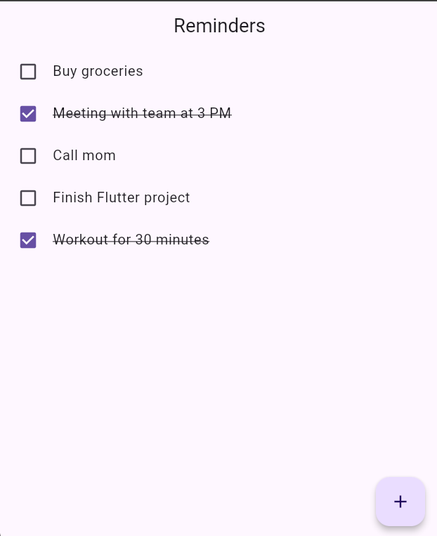
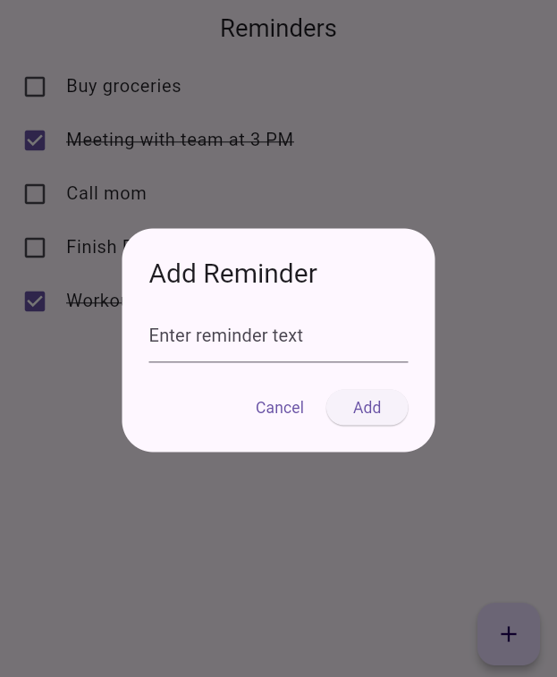

# Reminder App

A simple Flutter app to manage reminders with completion toggles using the BLoC pattern.

## Screenshots

## Features
- Add new reminders
- Toggle completion status of reminders

## BLoC Implementation

This app uses the **BLoC (Business Logic Component)** pattern for state management. Below are the main components and how they work:

### `ReminderBloc`
- **State**: `ReminderState` holds the list of reminders.
- **Events**:
  - `AddReminder`: Adds a new reminder to the list.
  - `ToggleReminderCompletion`: Toggles the `isCompleted` state of a specific reminder.

### `ReminderState`
- Holds the list of `Reminder` objects and is immutable to ensure proper UI updates.

### `Reminder`
- The model class representing a reminder with a `text` and a `isCompleted` flag.
- Includes a `copyWith` method to facilitate state immutability when updating reminders.
